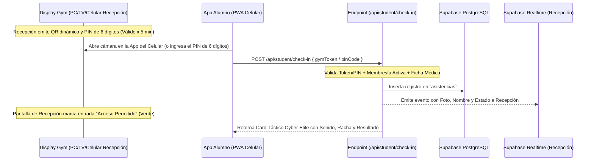

# Plan de Sprints: Reestructuración y Evolución del Módulo del Alumno (Socio / Usuario Final)

Este documento detalla el plan de sprints técnico para corregir bugs, optimizar la navegación multi-tenant, implementar la pasarela de pagos y renovaciones, ajustar la visión biomecánica y lanzar el sistema de reservas y rutinas genéricas para los alumnos de **Virtud Gym**.

---

## 📌 Arquitectura y Flujo de Procesos

---

## 🗓️ Cronograma de Sprints (Detalle Técnico)

### 🌀 SPRINT 1: Escáner de QR Dinámico del Gimnasio & Check-In Táctico (ACORDADO)
* **Objetivo:** Convertir el módulo de QR del alumno en un **escáner por cámara activa PWA (con opción de PIN de 6 dígitos)** para leer el QR que proyecta cualquier dispositivo de recepción del gimnasio (PC, TV, Celular de Recepción) y validar el check-in en tiempo real.

- [ ] **1.1 Emisor de QR Dinámico del Gimnasio (Cualquier Dispositivo)**
  - Crear vista responsiva multi-dispositivo en `src/app/tenants/[tenantSlug]/admin/recepcion/display-qr/page.tsx` y widget en `acceso/page.tsx`.
  - Generar token dinámico rotativo caducable a los **5 minutos**, acompañado de un **PIN de 6 dígitos** sincronizado.
- [ ] **1.2 Escáner Táctico en App Alumno (Cámara + PIN Fallback)**
  - Implementar en [qr/page.tsx](file:///c:/Users/User/Desktop/Virtud/src/app/tenants/[tenantSlug]/member/dashboard/qr/page.tsx) el lector de cámara con marco neón animado y feedback de vibración/audio.
  - Añadir pestaña de entrada manual de PIN de 6 dígitos por si el alumno deniega la cámara o falla el lente.
- [ ] **1.3 Backend Check-In API (`/api/student/check-in`)**
  - Validar token o PIN de 5 min en servidor contra el `gimnasio_id`.
  - Verificar en backend: Membresía activa (`estado_membresia === 'active'`) + Ficha Médica/PAR-Q firmada (`exencion_aceptada || parq_firmado`).
- [ ] **1.4 Notificación Realtime a Recepción y Card de Resultado al Alumno**
  - Transmitir evento a recepción vía Supabase Realtime (`reception_asistencias_realtime`).
  - Renderizar en el celular del alumno un Card Cyber-Elite con racha actual, animación de estado y botón de resolución directa si fue denegado (ej. Ir a Pagar / Firmar Ficha Médica).

---

### 🌀 SPRINT 2: Conexión Real de Reservas de Clases & Estandarización de Ficha Médica (ACORDADO)
* **Objetivo:** Eliminar datos simulados en reservas, conectar `bookingsService` atómico a Supabase y unificar la comprobación y firma digital de la Ficha Médica.

- [ ] **2.1 Ventana de Reserva y Cancelación (Reglas de Negocio Acordadas)**
  - Configurar reservas con hasta **30 días de anticipación**.
  - Permitir cancelación gratuita hasta **15 minutos antes del inicio** de la clase.
- [ ] **2.2 Promoción Automática en Lista de Espera (Atomic DB RPC)**
  - Al agotarse los cupos, registrar alumno en `en_lista_espera`.
  - Al cancelar un alumno, ejecutar `promote_waitlist_atomic` para promover automáticamente al 1º de la lista a `reservada` enviando notificación PWA/In-App.
- [ ] **2.3 Eliminación de Mock & Conexión Real a Supabase**
  - Eliminar el arreglo duro `mockClasses` en [booking/page.tsx](file:///c:/Users/User/Desktop/Virtud/src/app/tenants/[tenantSlug]/member/booking/page.tsx).
  - Conectar la grilla a la API real y la base de datos a través de `bookingsService`.
- [ ] **2.4 Helper SSOT de Ficha Médica & Modal In-App de Firma Digital**
  - Crear la función utilitaria `hasCompletedMedicalWaiver(profile)` en `@/lib/utils/health-waiver.ts` (`exencion_aceptada || parq_firmado`).
  - Si el alumno no la ha firmado, desplegar un modal interactivo en pantalla ("Ficha Médica Pendiente") con CTA para **firmar el PAR-Q digital en menos de 1 minuto** sin perder el contexto.

---

### 🌀 SPRINT 3: Navegación Relativa Universal & Multi-Tenancy Estricto (ACORDADO)
* **Objetivo:** Garantizar que ninguna acción o enlace del alumno expulse al usuario del contexto del gimnasio o rompa la URL.

- [ ] **3.1 Hook Estandarizado `useTenantNavigation` (`tenantHref` y `tenantPush`)**
  - Utilizar [useTenantNavigation.ts](file:///c:/Users/User/Desktop/Virtud/src/hooks/useTenantNavigation.ts) para generar URLs dinámicas (`tenantHref`) y ejecutar redirecciones imperativas (`tenantPush`) adaptadas tanto a subdominios (`gym.virtud.fit`) como a subrutas (`virtud.fit/tenants/gym-slug`).
- [ ] **3.2 Refactorización de Enlaces Absolutos en Vistas del Alumno**
  - Reemplazar todas las cadenas duras `href="/schedule"`, `href="/dashboard"`, `href="/dashboard/profile/complete"` y `router.push('/dashboard')` en:
    - [classes/page.tsx](file:///c:/Users/User/Desktop/Virtud/src/app/tenants/[tenantSlug]/member/dashboard/classes/page.tsx)
    - [routine/page.tsx](file:///c:/Users/User/Desktop/Virtud/src/app/tenants/[tenantSlug]/member/dashboard/routine/page.tsx)
    - [booking/page.tsx](file:///c:/Users/User/Desktop/Virtud/src/app/tenants/[tenantSlug]/member/booking/page.tsx)
    - [messages/page.tsx](file:///c:/Users/User/Desktop/Virtud/src/app/tenants/[tenantSlug]/member/dashboard/messages/page.tsx)
    - [complete/page.tsx](file:///c:/Users/User/Desktop/Virtud/src/app/tenants/[tenantSlug]/member/dashboard/profile/complete/page.tsx)
    - [report-issue/page.tsx](file:///c:/Users/User/Desktop/Virtud/src/app/tenants/[tenantSlug]/member/dashboard/report-issue/page.tsx)
- [ ] **3.3 Preservación de Tenant en Expiración de Sesión**
  - Si la sesión expira o el alumno cierra sesión, redirigir a `/login?tenant=[slug]` para que al volver a autenticarse retorne automáticamente al dashboard de su propio gimnasio.

---

### 🌀 SPRINT 4: Módulo de Pagos Cyber-Elite & Flujo de Renovación Auto-Servicio (ACORDADO)
* **Objetivo:** Re-diseñar visualmente la pantalla de pagos e integrar el selector de planes y métodos de cobro habilitados (MercadoPago, Transferencia y Efectivo en Recepción).

- [ ] **4.1 Rediseño Estético Cyber-Elite**
  - Modernizar [payments/page.tsx](file:///c:/Users/User/Desktop/Virtud/src/app/tenants/[tenantSlug]/member/dashboard/payments/page.tsx) utilizando tarjetas `EliteCard`, gradientes neón, desglose de facturación y visor de comprobantes.
- [ ] **4.2 Selector Interactivo de Planes (`planes_gimnasio`)**
  - Crear modal de selección de planes consultando la tabla `planes_gimnasio`, mostrando vigencia, precio y beneficios.
- [ ] **4.3 Métodos de Cobro Habilitados**
  - **MercadoPago Online:** Integrar pasarela con activación automática inmediata tras webhook exitoso.
  - **Transferencia Bancaria:** Conectar modal `ReportPaymentModal` para subir el comprobante de transferencia y dejar el pago en revisión del admin.
  - **Efectivo en Recepción:** Permitir cobrar mediante el POS `/admin/recepcion/pos`, el cual actualiza el estado del socio a `active` otorgando acceso inmediato.
- [ ] **4.4 Recibos Digitales Descargables**
  - Conectar en cada fila del historial el botón "Ver Recibo Digital" que abra la vista `/member/payments/[id]/receipt` con membrete del gimnasio y opción de imprimir/descargar PDF.

---

### 🌀 SPRINT 5: Rutinas Genéricas por Objetivo, Visión Biomecánica & Mediciones (ACORDADO CON EL USUARIO)
* **Objetivo:** Permitir que los alumnos sin rutina personalizada elijan rutinas genéricas ejecutables, corregir la tabla de mediciones y estructurar el Dossier Biomecánico del Alumno.

- [ ] **5.1 Corrección de Tabla de Mediciones Corporales**
  - Corregir en [progress/page.tsx](file:///c:/Users/User/Desktop/Virtud/src/app/tenants/[tenantSlug]/member/dashboard/progress/page.tsx) la proyección de mediciones individuales por fecha (`Pecho`, `Cintura`, `Cadera`, `Brazos`, `Piernas`) con insignias de tendencia y modal Cyber-Elite para agregar registros.
- [ ] **5.2 Biblioteca de Rutinas Genéricas Tácticas por Objetivo**
  - Diseñar selector de rutinas predeterminadas según el objetivo del socio (Pérdida de Grasa, Hipertrofia, Fuerza, Calistenia, Movilidad) en `routine/page.tsx` y `RoutinePreview.tsx`.
  - Asignar la rutina seleccionada para ejecución inmediata en `WorkoutPlayer`.
- [ ] **5.3 Dossier Biomecánico del Alumno (`vision/page.tsx`)**
  - Restringir la grabación/subida de videos al profesor.
  - Configurar la vista del alumno en `vision/page.tsx` para consultar la librería de informes analizador por el coach, visualizar puntajes de IA, reproducir video y enviar calificaciones/comentarios a su entrenador.

---

## 🎨 Especificaciones Visuales y Animaciones Virtud UI/UX
* **Paleta de Colores:** Fondo `#0a0a0a` puro, detalles en verde esmeralda táctico (`#10b981`), cian cibernético (`#06b6d4`) y magenta neón (`#d946ef`).
* **Efectos de Transición:** Entradas escalonadas con Framer Motion (`staggerChildren: 0.1`), tarjetas translúcidas con `backdrop-blur-3xl`.
* **Visual Feedbacks:** Notificaciones flotantes tipo Toast y estados animados en tiempo real (`animate-pulse`, `scanline effect`).
