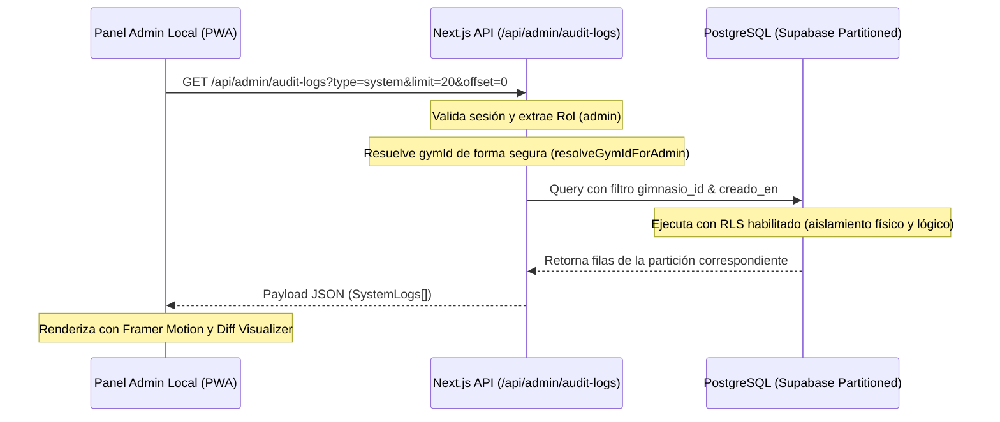

# Plan de Sprints: Reporte de Auditoría para el Rol de Administrador (Local Tenant)

Este documento detalla el plan de sprints para la implementación del módulo de **Reporte de Auditoría** dedicado al rol de **Admin** local de cada gimnasio. El objetivo principal es dotar al administrador de cada sede de una consola de trazabilidad detallada e inmutable sobre los cambios en sus datos, garantizando aislamiento multi-tenant estricto y una experiencia visual de primer nivel (UI/UX Premium).

---

## 📌 Arquitectura y Flujo de Datos



---

## 🗓️ Cronograma de Sprints (Detalle Técnico)

### 🌀 SPRINT 1: Seguridad, Backend API y Aislamiento Multi-Tenant
* **Objetivo:** Adaptar y securizar el endpoint de la API para permitir el acceso controlado a los administradores locales, garantizando que solo consulten datos de su propio gimnasio y bloqueando información confidencial global (como impersonaciones).

- [ ] **1.1 Modificación de Autorización en Endpoint**
  - Modificar [route.ts](file:///c:/Users/User/Desktop/Virtud/src/app/api/admin/audit-logs/route.ts) para aceptar tanto `superadmin` como `admin` en `authenticateAndRequireRole`.
- [ ] **1.2 Resolución del ID de Gimnasio (SSOT)**
  - Utilizar el helper `resolveGymIdForAdmin` para obtener el `targetGymId` a partir del perfil del usuario autenticado.
- [ ] **1.3 Filtrado de Datos Confidenciales**
  - Si el rol del usuario es `admin`, denegar y omitir la consulta a logs de impersonación (`logs_acceso_remoto`), los cuales deben permanecer estrictamente para `superadmin`.
  - Aplicar filtro `eq('gimnasio_id', targetGymId)` en la query a la tabla `audit_logs`.
- [ ] **1.4 Validación de Políticas RLS en la Base de Datos**
  - Verificar que la política `"Multi-tenant: Acceso a logs por gimnasio"` en la tabla `public.audit_logs` funcione correctamente con las consultas desde la API con el rol `admin`.
- [ ] **1.5 Pruebas Unitarias de Aislamiento**
  - Desarrollar pruebas en `src/app/api/admin/audit-logs/__tests__/` (o carpeta correspondiente) simulando un Admin del gimnasio A intentando consultar logs con un parámetro `gymId` del gimnasio B, esperando un código de respuesta `403 Forbidden` o filtrado automático.

---

### 🌀 SPRINT 2: Integración de Vistas y Estructura de Navegación
* **Objetivo:** Integrar la nueva sección dentro del panel administrativo local de los inquilinos, estableciendo la ruta del cliente y los accesos en el menú de navegación.

- [ ] **2.1 Creación de Rutas en Carpeta de Inquilinos**
  - Crear el directorio `src/app/tenants/[tenantSlug]/admin/audit/`.
  - Crear el archivo [page.tsx](file:///c:/Users/User/Desktop/Virtud/src/app/tenants/[tenantSlug]/admin/audit/page.tsx) con la estructura base de Next.js y el envoltorio `UniversalLayoutWrapper`.
- [ ] **2.2 Configuración de Enlaces en Sidebar Dinámico**
  - Modificar [UniversalSidebar.tsx](file:///c:/Users/User/Desktop/Virtud/src/components/layout/UniversalSidebar.tsx) para agregar el nuevo item en la lista del rol `admin`:
    ```typescript
    { href: '/admin/audit', label: 'Auditoría de Cambios', icon: '🔍' }
    ```
- [ ] **2.3 Validación de Soporte para Subdominios**
  - Validar que la resolución de rutas en la barra lateral funcione tanto en modo de path (`/gimnasio-slug/admin/audit`) como en modo de subdominio personalizado (`admin.gimnasio.com/admin/audit`).

---

### 🌀 SPRINT 3: UI/UX Premium, Animaciones y Comparador de Payload (Git-Diff)
* **Objetivo:** Diseñar una interfaz interactiva moderna y con diseño oscuro premium, dotada de micro-animaciones fluidas y un comparador de diferencias semánticas.

- [ ] **3.1 Diseño de Grid y Listado de Logs**
  - Crear una vista de tarjetas de actividad dinámicas con estados de colores según la operación (`INSERT` en verde esmeralda, `UPDATE` en azul eléctrico, `DELETE` en rojo carmesí).
- [ ] **3.2 Filtros Avanzados y Buscador Reactivo**
  - Buscador de texto completo que filtre localmente o vía API por usuario responsable, ID de registro o tabla.
  - Filtro por operación (Insert, Update, Delete) y rango de fechas utilizando un selector calendario estilizado.
- [ ] **3.3 Animación de Transición de Estados**
  - Implementar animaciones de carga ("Skeleton loaders") y transiciones con `framer-motion` al cambiar de página o aplicar filtros.
- [ ] **3.4 Modal de Detalle y Diff Visualizer**
  - Diseñar un modal interactivo con efecto de desenfoque de fondo ("backdrop-blur").
  - Desarrollar un visualizador de diferencias ("Git-Diff Style") que compare las columnas modificadas de `datos_anteriores` y `datos_nuevos` resaltando con fondo rojo tenue las eliminaciones y verde tenue las adiciones.

---

### 🌀 SPRINT 4: Exportación, Rendimiento y Cierre de Auditoría
* **Objetivo:** Agregar herramientas útiles de reporte y optimizar las consultas a la base de datos particionada.

- [ ] **4.1 Generación y Exportación a CSV**
  - Implementar la funcionalidad para exportar los logs actualmente filtrados a formato CSV, incluyendo metadatos limpios y estructurados.
- [ ] **4.2 Optimización de Paginación y Rendimiento**
  - Garantizar que las consultas utilicen de forma efectiva el índice compuesto `audit_logs_gym_fecha_idx` para asegurar tiempos de respuesta inferiores a 100ms incluso con millones de registros.
- [ ] **4.3 Control de Límites y Caching**
  - Ajustar parámetros de paginación rígidos en la API (ej. limit=50) para evitar sobrecargar el ancho de banda del cliente.
- [ ] **4.4 Remediaciones de TypeScript & Linter**
  - Correr `npm run lint` y verificar que la página y endpoints creados no generen ningún warning o error en el proyecto.
- [ ] **4.5 Verificación de Usabilidad y Cobertura**
  - Realizar pruebas manuales de flujo completo y verificar la visualización correcta en dispositivos móviles y de escritorio.

---

## 🎨 Aspectos Estéticos del Diseño (Alineación Virtud UI/UX)
Para asegurar que la pantalla sea visualmente impresionante y moderna:
* **Paleta de Colores:** Fondo `#0a0a0a` puro, componentes principales con tarjetas `#1c1c1e` de bordes redondeados pronunciados (`rounded-3xl` / `rounded-[2.5rem]`).
* **Brillo y Aura:** Utilizar la clase CSS `.aurora-bg` para dar profundidad al fondo.
* **Tipografía:** Rajdhani/Inter para mantener un aspecto moderno, deportivo y tecnológico.
* **Micro-interacciones:** Escalamiento suave (`hover:scale-[1.02]`) y cambios de color de borde con transición fluida (`transition-all duration-300`).
* **Legibilidad del Diff:** Los bloques de cambios de código o JSON deben tener una fuente monoespaciada estilizada y fondos con gradientes sutiles.
