# Plan de Sprints: Reporte de Recepción para el Rol de Administrador (Local Tenant)

Este documento detalla el plan de sprints para la implementación del módulo de **Reporte de Recepción** dedicado al rol de **Admin** y **Superadmin** de Virtud Gym. El objetivo principal es dotar al administrador de una consola de control que consolide la asistencia diaria (incluyendo bypasses manuales con justificación) y la operatoria financiera de caja/arqueos de cada turno de recepción, asegurando aislamiento multi-tenant estricto y una experiencia visual de primer nivel (UI/UX Premium).

---

## 📌 Arquitectura y Flujo de Datos

```mermaid
sequenceDiagram
    participant Admin as Panel Admin Local (PWA)
    participant API as Next.js API (/api/admin/reports/reception/...)
    participant DB as PostgreSQL (Supabase)

    Admin->>API: Consultar Reporte (Fechas, Recepcionista)
    Note over API: Valida sesión & rol (admin/superadmin)
    Note over API: Resuelve gymId de forma segura (resolveGymIdForAdmin)
    
    rect rgb(35, 35, 45)
        Note over API: Flujo 1: Reporte de Ingresos & Bypasses
        API->>DB: Query en 'asistencias' filtrada por gymId y fecha
        DB-->>API: Total ingresos & logs de bypasses
    end
    
    rect rgb(35, 45, 35)
        Note over API: Flujo 2: Reporte de Arqueos & Caja
        API->>DB: Query en 'auditoria_global' por gymId y fecha ('cierre_caja_recepcion')
        DB-->>API: Historial de cierres de caja, montos y diferencias
    end
    
    API-->>Admin: Payload JSON Consolidado
    Note over Admin: Renderizado con Framer Motion, Charts y Modales de Arqueo
```



---

## 🗓️ Cronograma de Sprints (Detalle Técnico)

### 🌀 SPRINT 1: Backend, Base de Datos y APIs Multi-Tenant
* **Objetivo:** Implementar los endpoints seguros en Next.js para suministrar la información del módulo de recepción con blindaje multitenant estricto.

- [ ] **1.1 Crear Endpoint de Asistencia y Bypasses**
  - Crear el archivo [route.ts](file:///c:/Users/User/Desktop/Virtud/src/app/api/admin/reports/reception/attendance/route.ts).
  - Deberá recibir `range` (fecha_desde / fecha_hasta) y opcionalmente un `usuario_id` del recepcionista para filtrar.
  - Retornar:
    - Cantidad total de check-ins en el rango.
    - Desglose por método: `qr` vs `manual_recepcion` vs `reception_bypass`.
    - Listado de registros con `source = 'reception_bypass'`, incluyendo los detalles de la justificación (`motivo`), nombre del alumno (`perfiles(nombre_completo)`) y nombre del recepcionista que autorizó (`detalles.autorizado_por` en `auditoria_global`).
- [ ] **1.2 Crear Endpoint de Historial de Caja y Arqueo**
  - Crear el archivo [route.ts](file:///c:/Users/User/Desktop/Virtud/src/app/api/admin/reports/reception/cash-sessions/route.ts).
  - Deberá consultar los eventos de `auditoria_global` con `gimnasio_id = targetGymId` y `accion = 'cierre_caja_recepcion'`.
  - Retornar un historial completo de turnos cerrados con la siguiente información estructurada:
    - Fecha y hora de apertura y cierre.
    - Nombre del cajero/recepcionista responsable.
    - Monto inicial y egresos registrados.
    - Ventas teóricas/computadas por canal (efectivo, tarjeta, QR/transferencia).
    - Monto físico declarado por el cajero (efectivo, tarjeta, QR).
    - Diferencia/Discrepancia calculada por método de pago.
- [ ] **1.3 Integrar Seguridad y Blindaje Multi-Tenant**
  - Utilizar `authenticateAndRequireRole(request, ['admin', 'superadmin'])` en ambos endpoints.
  - Resolver de forma segura el gimnasio a través del helper `resolveGymIdForAdmin(profile, urlGymParam)`.
  - Garantizar que un administrador local no pueda consultar el historial de otras sedes.

---

### 🌀 SPRINT 2: Integración en la Interfaz (Cliente y Navegación)
* **Objetivo:** Crear la ruta de página principal en el módulo de inquilinos y enlazarla desde la barra lateral y el módulo general de reportes.

- [ ] **2.1 Crear Página del Reporte de Recepción**
  - Crear el directorio `src/app/tenants/[tenantSlug]/admin/reports/reception/`.
  - Crear el archivo [page.tsx](file:///c:/Users/User/Desktop/Virtud/src/app/tenants/[tenantSlug]/admin/reports/reception/page.tsx) con el envoltorio `UniversalLayoutWrapper` para verificar roles y aplicar layout base.
- [ ] **2.2 Configuración del Sidebar Dinámico**
  - Modificar [UniversalSidebar.tsx](file:///c:/Users/User/Desktop/Virtud/src/components/layout/UniversalSidebar.tsx) para agregar el nuevo item en la lista del rol `admin` y `superadmin` cuando visualice la consola:
    ```typescript
    { href: '/admin/reports/reception', label: 'Reporte de Recepción', icon: '📋', module: 'Pos' }
    ```
  - Comprobar que solo aparezca si el módulo `Pos` o de caja está habilitado para el tenant.
- [ ] **2.3 Vincular desde la Pantalla de Reportes General**
  - En la página principal de analytics [page.tsx](file:///c:/Users/User/Desktop/Virtud/src/app/tenants/[tenantSlug]/admin/reports/page.tsx), añadir una tarjeta de acceso directo o botón destacado que redirija a `/admin/reports/reception` para mejorar la usabilidad del administrador.

---

### 🌀 SPRINT 3: UI/UX Premium, Métricas y Gráficos Reactivos
* **Objetivo:** Construir una interfaz visualmente deslumbrante que presente estadísticas consolidadas, tablas de auditoría detalladas y modales interactivos para arqueo de caja.

- [ ] **3.1 Diseño de Encabezado y Filtros Globales**
  - Título moderno con tipografía destacada e indicador de rango de fechas (Semana, Mes, Trimestre, Personalizado).
  - Filtro por personal de recepción (desplegable que cargue perfiles con rol `recepcion` y `admin` del gimnasio).
- [ ] **3.2 Vista de Tarjetas KPI Consolidadas**
  - Diseñar tarjetas con fondos oscuros semi-transparentes (`bg-[#1c1c1e]/60 backdrop-blur-xl`), bordes finos de gradiente y micro-animaciones en hover:
    - **Total Asistencias:** Total ingresos registrados.
    - **Bypasses Autorizados:** Cantidad de ingresos por bypass.
    - **Discrepancia Acumulada de Caja:** Sumatoria de las diferencias de arqueo. Alerta roja si es negativo, verde si es 0, naranja si es positivo.
    - **Total Egresos de Caja:** Monto total retirado para gastos menores.
- [ ] **3.3 Gráfico de Métodos de Ingreso e Histórico**
  - Implementar un gráfico de barras o áreas con `recharts` que muestre la cantidad de accesos a lo largo del tiempo, segmentado por tipo de ingreso (QR, Manual, Bypass) para identificar horas pico y patrones.
- [ ] **3.4 Tabla Detallada de Ingresos Excepcionales (Bypasses)**
  - Lista de bypasses mostrando foto del alumno, nombre del alumno, recepcionista que autorizó, motivo del bypass e indicador de fecha/hora formateada.
- [ ] **3.5 Historial y Detalle del Arqueo de Caja**
  - Listado de turnos de caja completados de forma cronológica.
  - Cada registro mostrará un badge descriptivo indicando si cerró con saldo "Exacto", "Sobrante" o "Faltante".
  - **Modal de Detalle del Turno:** Al hacer clic, se abre un modal con efecto de desenfoque de fondo (`backdrop-blur-md`) que detalla el arqueo: inicial, computado por sistema en efectivo/tarjeta/QR, declarado físicamente por el cajero, egresos justificados y firmas digitales del evento.

---

### 🌀 SPRINT 4: Exportación de Datos, Optimización y Pruebas
* **Objetivo:** Implementar herramientas de exportación para contabilidad y garantizar un rendimiento óptimo de las consultas a base de datos.

- [ ] **4.1 Exportación CSV para Contabilidad y Auditoría**
  - Desarrollar la lógica de exportación en el frontend para generar un archivo CSV limpio del listado de cierres de caja y bypasses de asistencia.
- [ ] **4.2 Creación de Índices de Base de Datos para Alto Rendimiento**
  - Crear un script de migración SQL para asegurar índices rápidos sobre las consultas repetidas de reportes:
    - Índice en `public.asistencias` compuesto por `(gimnasio_id, creado_en, source)`.
    - Índice en `public.auditoria_global` sobre `(gimnasio_id, accion, creado_en)`.
- [ ] **4.3 Control de Tipos (TypeScript) y Linter**
  - Validar que no existan errores de tipado o de sintaxis al ejecutar `npm run lint`.
- [ ] **4.4 Plan de Pruebas y Aceptación**
  - Realizar una suite de pruebas manuales simulando el registro de un bypass de asistencia y un cierre de caja, validando que impacte instantáneamente en el panel de reportes del administrador.

---

## 🎨 Aspectos Estéticos y Guías de Diseño (Alineación Virtud UI/UX)
* **Paleta de Colores:** Fondo oscuro `#0a0a0a` con componentes `#1c1c1e` con bordes redondeados `rounded-3xl` / `rounded-[2.5rem]`.
* **Micro-interacciones:** Escalamiento en hover `hover:scale-[1.02] transition-all duration-300`, badges de diferencia estilizados:
  - Faltante (Negativo): `#ef4444` (rojo) con fondo suave en opacidad del 10%.
  - Correcto: `#10b981` (esmeralda) con fondo suave en opacidad del 10%.
  - Sobrante (Positivo): `#f59e0b` (ámbar) con fondo suave en opacidad del 10%.
* **Tipografía:** Inter/Rajdhani para títulos y números grandes de KPI.
* **Componentes de Cristal (Glassmorphism):** Menús y modales con efectos de desenfoque de fondo premium.
