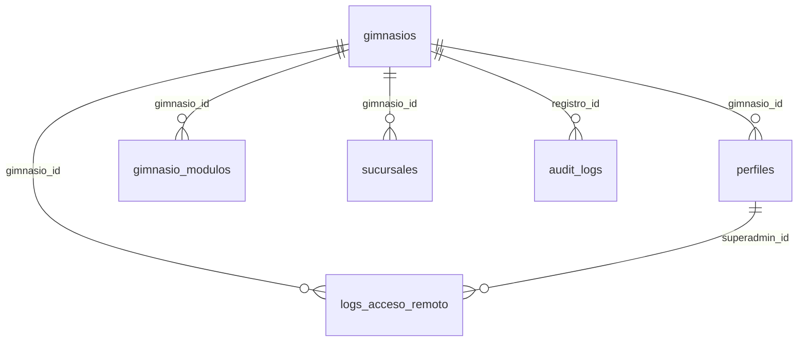

# 🛡️ Guía de Arquitectura y Operación del Superadmin (SaaS Hub)

Este documento sirve como manual técnico y operativo para el rol de **Superadmin** (Master Control SaaS) en la plataforma **Virtud Gym**.

---

## 1. Definición del Rol de Superadmin
El Superadmin es el administrador supremo del ecosistema SaaS. A diferencia del administrador local (`admin`), que está confinado a los datos de un único gimnasio (`gimnasio_id`), el Superadmin tiene visibilidad y control global sobre:
* Toda la red de gimnasios registrados (tenants).
* La facturación B2B, ofertas comerciales y catálogo de planes.
* El monitoreo de infraestructura (Carga de cómputo de IA, consumo de tokens).
* Auditoría forense de seguridad (Visualizador de payloads de la base de datos).
* Control de acceso remoto temporal (Impersonación) para soporte técnico.

---

## 2. Arquitectura de Datos Multi-Tenant (SaaS)
La base de datos PostgreSQL en Supabase está estructurada para soportar múltiples tenants aislados mediante la columna `gimnasio_id`.

### Modelo de Datos de Infraestructura SaaS



1. **`gimnasios`**: Tabla principal de inquilinos (tenants).
   * `id`: UUID (Primary Key).
   * `nombre`: Nombre del gimnasio.
   * `slug`: Identificador único en la URL (ej: `powerbox`).
   * `plan_id`: Suscripción activa.
   * `configuracion`: Configuración JSONB (color primario, logo, tema).
   * `es_activo`: Flag que bloquea/permite todo acceso al tenant.
2. **`gimnasio_modulos`**: Licencias o entitlements de características por gimnasio.
   * `modulo_key`: `'rutinas_ia'`, `'nutricion_ia'`, `'clases_reserva'`, `'pagos_online'`, `'gamificacion'`.
3. **`logs_acceso_remoto`**: Registro de impersonaciones por soporte.
   * `superadmin_id`: ID del Superadmin que inició sesión.
   * `gimnasio_id`: Gimnasio al que se accedió.
   * `motivo`: Explicación del soporte.
4. **`audit_logs`**: Ledger inmutable de transacciones SQL a nivel de base de datos.

### Políticas de Row Level Security (RLS)
El aislamiento de los inquilinos se realiza a nivel de base de datos usando políticas RLS:
```sql
-- Los miembros ordinarios solo acceden a perfiles e información de su gimnasio asignado
CREATE POLICY "Multi-tenant: Acceso a actividades por gimnasio" ON public.actividades
FOR ALL USING (gimnasio_id = public.get_user_gym_id());
```
* **Bypass de RLS del Superadmin**: Para las vistas globales de administración (facturación, métricas), las APIs correspondientes hacen uso del cliente de servicio administrativo (`createAdminClient()`), el cual sobrepasa las políticas de RLS de Supabase mediante el uso de la clave de servicio (`service_role`).

---

## 3. Flujo de Acceso Remoto (Impersonación)
Una de las herramientas más potentes del Superadmin es el **Acceso Remoto (Impersonation)**, el cual permite ingresar directamente a la pantalla del administrador local de cualquier gimnasio para diagnóstico o configuración sin conocer su contraseña.

### Diagrama del Flujo de Conexión
```
[Superadmin Dashboard]
        │
        ▼ (Clic en Acceso Remoto)
[Modal de Justificación Técnica] ──(Exige ingresar motivo de soporte)
        │
        ▼ POST /api/admin/impersonate
[Inserta log de Auditoría] ──(Se registra en `logs_acceso_remoto`)
        │
        ▼ (Retorna URL de redirección)
Redirección a: `/[gymId]/admin?impersonate=true`
        │
        ▼ (Next.js valida el query param)
[GymAdminDashboard] (Renderiza banner de soporte y habilita lectura/escritura)
```

* **Control de Salida**: Al finalizar el diagnóstico, el Superadmin hace clic en el banner superior "Salir del Acceso Remoto" y el sistema lo redirige de vuelta al panel SaaS global (`/saas-admin`).

---

## 4. Referencia de Endpoints del Superadmin

### A. Gestión de Red
* `GET /api/admin/gyms/list`: Retorna el catálogo completo de gimnasios registrados con sus respectivas sucursales.
* `POST /api/admin/gyms/create`: Registra un nuevo gimnasio en la red.
* `POST /api/admin/gyms/onboard`: Inicializa simultáneamente el gimnasio, crea el usuario administrador local, su sucursal inicial y le activa los módulos correspondientes.
* `POST /api/admin/gyms/update`: Modifica planes de cobro, colores corporativos, estado activo/inactivo y módulos de un gimnasio.

### B. Facturación y Planes
* `GET /api/admin/billing`: Detalles de facturación de gimnasios, estado de pago (`active`, `past_due`, `unpaid`) y fecha del próximo cobro.
* `POST /api/admin/billing`: Actualiza de forma manual el estado de pago o aplica descuentos globales de suscripción.
* `GET /api/admin/plans/list`: Lista los planes de suscripción.
* `POST /api/admin/plans`: Agrega planes de suscripción (VIP, Pro, Básico) determinando límites de sucursales y alumnos permitidos.

### C. Centro de Auditoría
* `GET /api/admin/audit-logs`: Filtra los logs de transacciones del sistema y las sesiones de impersonación de soporte por fecha.
* **Payload Git Diff**: La visualización frontend calcula el diff entre `datos_anteriores` y `datos_nuevos` del payload inyectando estilos de código para fácil lectura forense.

### D. Métricas y Sandbox
* `GET /api/saas-admin/metrics/history`: Entrega el historial económico mensual de ingresos y egresos de IA.
* `POST /api/saas-admin/sandbox/trigger`: Gatilla flujos simulados (ej: simular vencimientos de membresías, reabastecimiento de créditos, etc.) en el entorno de desarrollo.

---

## 5. UI/UX y Animación Premium del SaaS Hub
Para garantizar la experiencia de uso premium de nivel corporativo:
1. **Framer Motion**: Las transiciones entre pantallas, la apertura de modales y la carga del simulador financiero utilizan animaciones de escala (`scale: 0.98 -> 1`) y opacidad suave.
2. **Recharts**: Los paneles de analítica económica muestran gradientes lineales dinámicos (`colorIngresos`, `colorGastos`) con tooltips interactivos que muestran los montos formateados en moneda de curso legal (`$`).
3. **Responsive Grid Layout**: Diseñado con un enfoque móvil/primero, colapsando las tablas masivas en tarjetas interactivas de fácil lectura en tablets y móviles.
